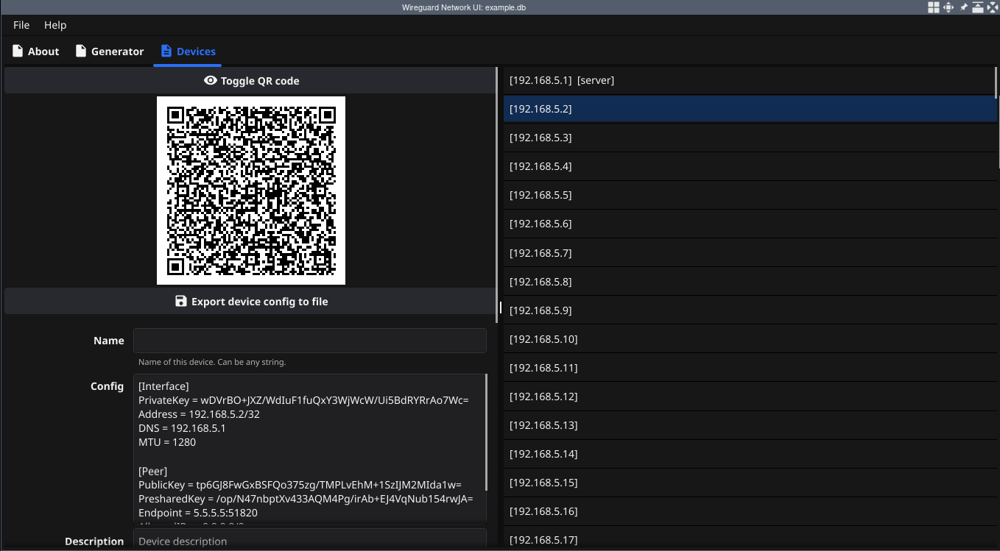
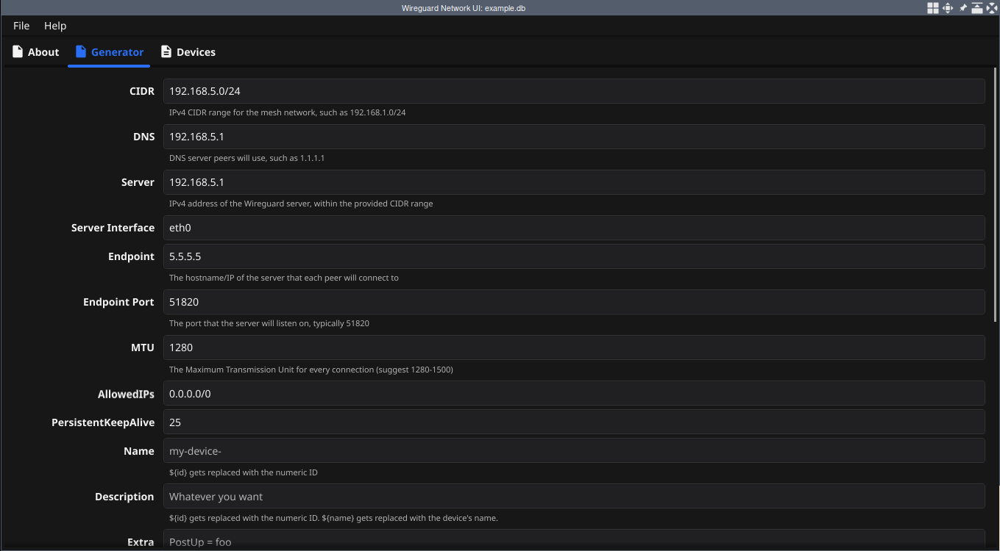

# wgnetui

A [Fyne-based](https://fyne.io/) UI for creating an IPv4 Wireguard network of any reasonable size, centered around a primary server with peers connecting to it.

For example, suppose you wanted to have a mesh network at `192.168.10.0/24`, and you want to have a publicly exposed Wireguard server at the WAN IP `5.5.5.5`. Peers will connect to `5.5.5.5:51820` by default (just an example). Let's also declare that `192.168.10.1` will be the server's LAN-internal IP address. `wgnetui` will allow you to create Wireguard configs for all ~255 possible devices on that `/24` network, including the primary server's config, which will contain mappings of Wireguard public keys and their allowed IP's.

What makes `wgnetui` useful is persistence between changes in the CIDR that you've chosen for your network. Devices are stored relative to the first one, so if you have chosen `192.168.10.0/24` as your network and have added 10 actual devices, but later decide that you want to expand/alter the network to something like `192.168.4.0/22`, `wgnetui` will keep the same devices in order and in their respective positions relative to the first device.

## Screenshots

## Warnings

`wgnetui` is extremely unpolished software and is not ready for public use. However, if you know how to use it, it solves the job that it was written to solve, there are just some unfinished quirks that may come up along the way. I have been successfully using it for half a year without many issues.

Builds are currently only available for Linux amd64. Other platforms don't seem to cross-compile for me yet.

## Roadmap

This is more of a wishlist/TODO list than a formal roadmap. Some of these may already be done. Will revisit.

- fix error that shows on startup when starting a new DB
- fix the devices list not always populating correctly
- always make it easy to find the server in the devices view
- add Recently Opened view in the landing page tab (currently the About tab)
- add GenForm option to purge all devices that don't belong in the generated list (as opposed to just clearing out everything)
  - this can be done by querying all devices that are not contained within the current network
  - might be a little slow though, and has to be done after the generation is done
- when updating the server, offer to regenerate everything over again, if feasible?
- consider adding SSH capabilities, such as:
  - ability to specify SSH hostname (ideally for interoperability with an ssh config file somehow)
- consider adding a ServerDNS field to the genform
- consider setting the peer config to a password multiline entry if it exists
- consider adding a detector/'*' symbol when a device has actually changed
- update the landing screen
- use a splash screen
- future: add a tab for pinging other peers, and doing service checks?

## Development notes

This was my first serious attempt at a project with Fyne. I hope that Fyne continues to grow and find success as time goes on. I found that Fyne was great to start out with, but unfortunately there are some unresolved issues that I do not see myself resolving - in particular:

- scrolling in a scrollable text input field that doesn't have a scrollbar causes the input to receive and drop the scroll wheel input (all OS's generally will bubble the event handler up the stack since it doesn't do anything with it)
- various keybindings such as ctrl+backspace and alt+backspace do not work in input fields
- undo buffers in text input fields are not implemented out of the box (this is common in most input fields - I could write it, but it's too much all at once)
- text area fields cannot show a large amount of text (such as the server's wireguard config) without significant lag
- the file picker portal is Fyne-specific and does not support bookmarks or any other typical behaviors you'd expect from a native portal (such as kde/gnome). I'm being picky here because the file picker is very difficult to work with when opening it to find files multiple times in short succession.
- light/dark themes as well as `FYNE_SCALE` options are difficult to work with and seem more like OS globals outside of the scope of any particular Fyne app than values I can provide configurable options for. The scaling in particular does not look good by default on the systems I've tested, so I have to set it to `0.7` manually as an environment variable, e.g. `FYNE_SCALE=0.7 ./wgnetui`. This is undesirable.

In the future, if I get the time, I would prefer to abandon Fyne in favor of a terminal user interface (TUI) application. I have successfully written others in recent times and prefer the interface.

Another caveat to add to this discussion is that I currently do not have builds working for any of the platforms described in the Makefile, except Linux amd64. This could be because of the fact that sqlite requires CGO, as well as Fyne also having some cross-compilation issues. This is just a greater motivation for a TUI rewrite sometime!
